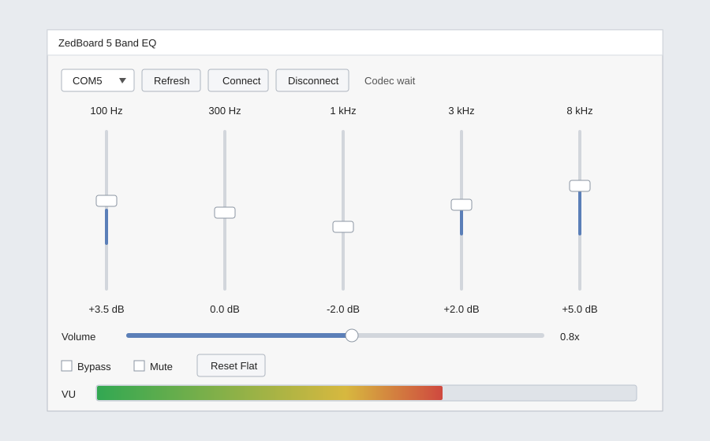

# FPGA-Based Hardware-Accelerated Audio Equalizer with GUI Control

A real-time 5-band audio equalizer built for the ZedBoard FPGA using Verilog-2001 and Vivado. The design processes live audio in FPGA fabric using cascaded IIR biquad filters, while a Python GUI controls EQ bands, volume, mute, bypass, and reset over UART.

The project also includes ADAU1761 codec configuration over I2C, I2S-style audio streaming, output volume control, saturation protection, and an LED VU meter on the ZedBoard.

## Key Features

- Real-time 5-band audio equalizer on FPGA
- Verilog-2001 RTL, Vivado-only hardware flow
- Cascaded IIR biquad filters for EQ processing
- Python GUI for live band gain and volume control
- UART command protocol between PC and FPGA
- ADAU1761 onboard codec setup using I2C
- I2S-style audio input/output interface
- LD0-LD7 LED VU meter showing output audio level
- Mute, bypass, reset-flat, and master volume control
- Modular RTL structure for easier debugging and explanation

## System Overview

```text
Python GUI
   |
   | UART packets
   v
FPGA UART Receiver
   |
   v
Control Register Bank
   |
   v
5-Band Biquad EQ Coefficients


Audio Input
   |
   v
ADAU1761 Codec
   |
   | I2S-style samples
   v
FPGA Audio Pipeline
   |
   v
5-Band Biquad IIR EQ
   |
   v
Volume Control + Saturation
   |
   +----> LED VU Meter
   |
   v
ADAU1761 Codec
   |
   v
Audio Output
```

## EQ Bands

The GUI controls five peaking-EQ bands:

| Band | Center Frequency |
| ---- | ---------------- |
| 1 | 100 Hz |
| 2 | 300 Hz |
| 3 | 1 kHz |
| 4 | 3 kHz |
| 5 | 8 kHz |

Each slider changes the gain of one band. The Python GUI calculates biquad coefficients and sends them to the FPGA as signed Q4.28 fixed-point values.

## Biquad Filter

Each EQ band is implemented as a second-order IIR biquad:

```text
y[n] = b0*x[n] + b1*x[n-1] + b2*x[n-2] - a1*y[n-1] - a2*y[n-2]
```

The FPGA stores five coefficients per band:

```text
b0, b1, b2, a1, a2
```

The biquad datapath is pipelined to meet timing after place and route.

## Repository Structure

```text
rtl/
  top_zedboard_eq.v          top-level ZedBoard integration
  clock_reset.v              reset handling

  codec/
    adau1761_config.v        ADAU1761 I2C startup configuration
    i2c_master.v             I2C write controller
    audio_codec_if.v         audio clocking and sample interface
    i2s_rx.v                 serial audio receiver
    i2s_tx.v                 serial audio transmitter

  dsp/
    biquad_iir.v             pipelined IIR biquad filter
    eq_5band.v               five cascaded biquad bands
    volume_control.v         master digital gain
    saturator.v              signed clipping protection
    vu_meter.v               LED audio level meter

  control/
    uart_rx.v                UART byte receiver
    uart_tx.v                UART byte transmitter
    uart_packet_parser.v     command packet decoder
    eq_register_bank.v       coefficients and control registers
    uart_status_tx.v         VU/status packet transmitter

  common/
    sync_reset.v
    edge_detect.v

constraints/
  zedboard_eq.xdc            ZedBoard pin constraints

gui/
  eq_gui.py                  Python Tkinter control GUI
  gui_preview.svg            static GUI preview

tb/
  tb_biquad_iir.v
  tb_eq_5band.v
  tb_uart_packet_parser.v

docs/
  hardware_notes.md
  uart_protocol.md
  demo_checklist.md

vivado_create_project.tcl
```

## Hardware Used

- ZedBoard FPGA development board
- Xilinx Zynq-7000 XC7Z020
- Onboard ADAU1761 audio codec
- 3.3 V USB-UART adapter for GUI control
- Audio source and headphones/speakers

## Important UART Note

The ZedBoard onboard USB-UART connector is connected to the PS MIO UART. This project is a pure PL RTL design, so the GUI UART is routed through PMOD JA instead.

Use a 3.3 V USB-UART adapter:

```text
USB-UART TX  ->  JA1 / UART_RX
USB-UART RX  ->  JA2 / UART_TX
GND          ->  GND
```

## Build In Vivado

Open Vivado and run:

```tcl
cd "C:/Users/AYUSH SHARMA/Documents/Codex/2026-05-28/i-want-you-to-create-y"
source vivado_create_project.tcl
```

Then:

1. Run synthesis
2. Run implementation
3. Generate bitstream
4. Program the ZedBoard

The top module is:

```text
top_zedboard_eq
```

## Run The GUI

Install pyserial:

```bash
pip install pyserial
```

Start the GUI:

```bash
python gui/eq_gui.py
```

The GUI provides:

- Serial port selection
- Connect/disconnect buttons
- Five EQ gain sliders
- Master volume slider
- Bypass control
- Mute control
- Reset-flat button
- Live VU meter display from FPGA status packets

## GUI Preview



## UART Protocol

PC to FPGA packet:

```text
A5 CMD INDEX DATA3 DATA2 DATA1 DATA0 CHECK
```

`CHECK` is the XOR of the first seven bytes.

Main commands:

| CMD | Meaning |
| --- | ------- |
| `01` | Set coefficient |
| `02` | Set master volume |
| `03` | Set flags |
| `04` | Reset to flat EQ |

FPGA to PC status packet:

```text
5A VU FLAGS CHECK
```

More details are in [`docs/uart_protocol.md`](docs/uart_protocol.md).

## LED VU Meter

The final processed output audio is measured inside the FPGA. The magnitude is smoothed with a simple decay and displayed as a bar graph on ZedBoard LEDs LD0-LD7.

This means the LEDs respond to the same signal being sent to the audio output.

## What This Project Demonstrates

This project combines multiple digital design areas:

- Real-time FPGA DSP
- Fixed-point arithmetic
- IIR filter implementation
- Timing-aware pipelined datapaths
- Audio codec configuration
- I2C peripheral control
- I2S-style serial audio transfer
- UART communication
- Hardware/software interaction using a Python GUI

## Interview Explanation

A short way to explain the project:

> I built a real-time 5-band audio equalizer on the ZedBoard FPGA. Audio samples come from the ADAU1761 codec, pass through five pipelined biquad IIR filters, then go through volume control and saturation before returning to the codec. A Python GUI sends new filter coefficients and control commands over UART, while the FPGA shows output audio level on the onboard LEDs.

The main point is that audio is processed fully in hardware. UART is used only for low-speed control data.

## Current Status

- RTL project created
- Bitstream generation verified in Vivado
- Python GUI implemented
- LED VU meter included
- Codec configuration table included

If audio output does not appear on first hardware test, the first area to check is the ADAU1761 analog routing and register configuration in:

```text
rtl/codec/adau1761_config.v
```

## Future Improvements

- Add more EQ presets in the GUI
- Add switch/button fallback controls on the ZedBoard
- Add frequency response plots to the GUI
- Use a Clocking Wizard for an exact 12.288 MHz audio master clock
- Add loopback and codec configuration self-test modes

## License

This project is intended for learning, FPGA portfolio work, and academic demonstration.
