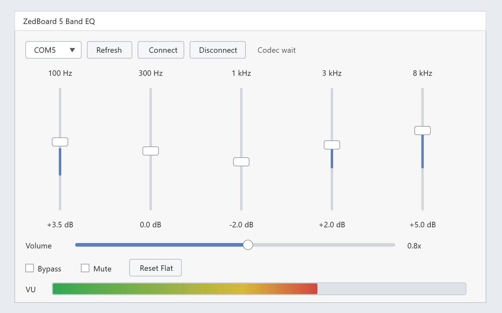

# ZedEQ — FPGA Based Audio Equalizer with GUI Control

A real-time 5-band parametric audio equalizer implemented entirely in FPGA programmable logic, with a Python desktop GUI for live control.



---

## Description

ZedEQ is an FPGA DSP project built on the ZedBoard (Xilinx Zynq-7000 XC7Z020) using Verilog-2001 and Vivado. Audio from the onboard ADAU1761 codec is processed in real time through five cascaded biquad IIR filters running in the programmable logic fabric. A Python GUI running on your PC lets you adjust each EQ band, control master volume, mute, bypass, and reset the EQ — all over UART.

The main idea was to keep everything in hardware: the filtering, volume control, saturation protection, and even the VU meter on the ZedBoard's onboard LEDs. The PC side only sends new coefficients when you move a slider — it plays no role in the actual audio path.

---

## Overview

| | |
|---|---|
| **Board** | ZedBoard (Xilinx Zynq-7000 XC7Z020) |
| **HDL** | Verilog-2001 |
| **Toolchain** | Vivado (PL-only, no SDK/Vitis) |
| **Audio Codec** | ADAU1761 (onboard) |
| **EQ Bands** | 5 (100 Hz, 300 Hz, 1 kHz, 3 kHz, 8 kHz) |
| **Filter Type** | Cascaded second-order IIR biquad |
| **Coefficient Format** | Q4.28 signed fixed-point |
| **PC Interface** | UART via PMOD JA (3.3V USB-UART adapter) |
| **GUI** | Python + Tkinter + pyserial |
| **VU Meter** | LD0–LD7 onboard LEDs |

---

## How It Works

Audio comes in through the ADAU1761 codec via an I2S-style interface, runs through five cascaded pipelined biquad IIR filters, hits a volume stage with saturation clipping, then goes back out through the codec. The onboard LEDs show a VU meter of the post-processed signal in real time.

The Python GUI calculates biquad coefficients from slider positions and sends them to the FPGA as Q4.28 fixed-point values over a UART packet protocol. There's no processing happening on the PC side during audio playback — it only sends new coefficients when you move a slider.

```
Python GUI  →  UART packets  →  FPGA UART RX  →  Control Register Bank
                                                         |
                                                         ↓
Audio In → ADAU1761 → I2S RX → 5-Band Biquad EQ → Volume/Sat → I2S TX → ADAU1761 → Audio Out
                                                                    |
                                                                    ↓
                                                               LED VU Meter
```

## EQ Bands

| Band | Frequency |
|------|-----------|
| 1    | 100 Hz    |
| 2    | 300 Hz    |
| 3    | 1 kHz     |
| 4    | 3 kHz     |
| 5    | 8 kHz     |

Each band is an independent peaking EQ implemented as:

```
y[n] = b0·x[n] + b1·x[n-1] + b2·x[n-2] - a1·y[n-1] - a2·y[n-2]
```

The biquad datapath is pipelined — if you try to run it combinationally it won't meet timing after P&R.

---

## Repo Layout

```
rtl/
  top_zedboard_eq.v

  codec/
    adau1761_config.v      I2C startup sequence for the codec
    i2c_master.v
    audio_codec_if.v
    i2s_rx.v
    i2s_tx.v

  dsp/
    biquad_iir.v           the filter core — pipelined
    eq_5band.v             five cascaded biquad stages
    volume_control.v
    saturator.v            signed clipping so you don't get wrap-around
    vu_meter.v

  control/
    uart_rx.v
    uart_tx.v
    uart_packet_parser.v
    eq_register_bank.v
    uart_status_tx.v

  common/
    sync_reset.v
    edge_detect.v

constraints/
  zedboard_eq.xdc

gui/
  eq_gui.py

tb/
  tb_biquad_iir.v
  tb_eq_5band.v
  tb_uart_packet_parser.v

docs/
  hardware_notes.md
  uart_protocol.md
  demo_checklist.md

vivado_create_project.tcl
```

---

## Hardware

- ZedBoard (Xilinx Zynq-7000 XC7Z020)
- Onboard ADAU1761 audio codec
- 3.3V USB-UART adapter for the GUI connection (see below)
- Any audio source + headphones or speakers

### UART Wiring — Read This

The ZedBoard's onboard USB-UART goes to the PS MIO, not the PL. Since this project is pure PL RTL, UART is routed through **PMOD JA** instead.

```
USB-UART TX  →  JA1  (FPGA UART_RX)
USB-UART RX  →  JA2  (FPGA UART_TX)
GND          →  GND
```

Use a 3.3V adapter. Don't use 5V logic on the PMOD pins.

---

## Build

Open Vivado and run the project creation script:

```tcl
cd "C:/path/to/your/project"
source vivado_create_project.tcl
```

Then synthesize → implement → generate bitstream → program. Top module is `top_zedboard_eq`.

---

## GUI

```bash
pip install pyserial
python gui/eq_gui.py
```

Select your COM port, hit Connect, and the sliders update the FPGA in real time. The VU meter at the bottom reflects what the FPGA is actually measuring at the output stage — not something calculated on the PC side.

Controls: 5 EQ band sliders, master volume, bypass, mute, reset-to-flat.

---

## UART Protocol

**PC → FPGA** (8 bytes):
```
A5  CMD  INDEX  DATA3  DATA2  DATA1  DATA0  CHECK
```
`CHECK` = XOR of the first 7 bytes.

| CMD  | Action              |
|------|---------------------|
| `01` | Set EQ coefficient  |
| `02` | Set master volume   |
| `03` | Set flags (mute/bypass) |
| `04` | Reset to flat EQ   |

**FPGA → PC** (4 bytes):
```
5A  VU  FLAGS  CHECK
```

Full protocol details in [`docs/uart_protocol.md`](docs/uart_protocol.md).

---

## Current State

RTL is complete, bitstream generates cleanly, GUI is working. If you get no audio on first hardware bring-up, start with `rtl/codec/adau1761_config.v` — the analog routing registers in the ADAU1761 are the most likely culprit.

## Things Still On the List

- EQ presets in the GUI
- Hardware fallback controls (ZedBoard switches/buttons)
- Frequency response plot overlay
- Proper 12.288 MHz audio clock via Clocking Wizard (currently approximated)
- Codec config self-test / loopback mode

---

## License

For learning, portfolio, and academic use.
